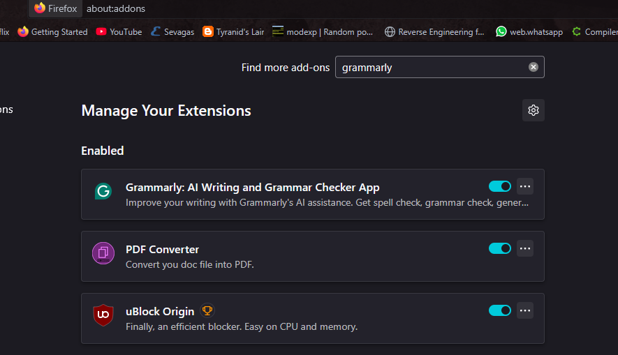
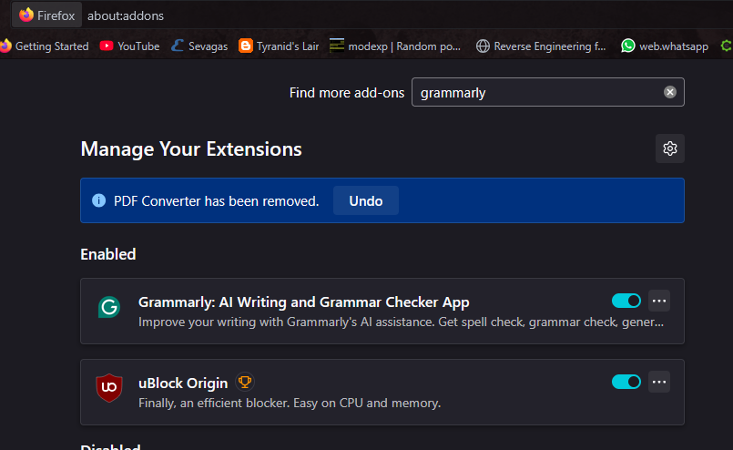

# Task 7 - Identify and Remove Suspicious Browser Extensions
**Cyber Security Internship**  
**Objective:** Learn to spot and remove potentially harmful browser extensions.

---

## 1️⃣ Browser Used
- Firefox *(replace with Firefox if applicable)*

---

## 2️⃣ Steps Taken

### Opened Browser Extension Manager
- Navigated to `about:addons`.

### Reviewed Installed Extensions
| Extension Name  | Permissions | Reviews  | Comments |
|-----------------|-------------|----------|----------|
| uBlock Origin   | Read and change data on all websites | Positive | Trusted ad-blocker |
| Grammarly       | Read and change data on websites | Positive | Trusted writing assistant |
| PDF Converter   | Read browsing history, change data | Mixed    | Looked suspicious |

### Identified Suspicious Extensions
- **PDF Converter** was identified as suspicious:
  - Requested unnecessary permissions (Read browsing history).
  - Reviews mentioned issues like pop-ups and redirects.

### Actions Taken
- Removed **PDF Converter**.
- Restarted browser.

### Post-removal Check
- Browser performance is stable.
- No suspicious ads or redirects seen.

---

## 3️⃣ Research & Key Learnings

### How malicious extensions can harm users:
- Steal passwords and browsing data.
- Monitor online activities.
- Inject malicious advertisements.
- Download other malware.

### Permissions to Watch Out For:
- Read browsing history.
- Change data on all websites.
- Access file system.
- Capture screen.

### Safe Installation Practices:
- Install only from official browser stores.
- Check extension reviews and developer background.
- Review permissions requested.

### What is Extension Sandboxing?
- Sandboxing isolates extensions from core browser processes.
- It limits their ability to interact with sensitive data unless permissions are explicitly granted.

### Can Extensions Steal Passwords?
- Yes, if given access to "read data on all websites" or inject scripts into login pages.

### Updating Extensions Securely:
- Let browsers auto-update extensions from the official store.
- Avoid third-party download sites.

### Extensions vs. Plugins:
| Extensions                      | Plugins                              |
|---------------------------------|--------------------------------------|
| Installed via browser store     | External software installed separately |
| Runs in browser sandbox         | Runs with elevated system privileges  |
| Enhances browser functionality  | Enables content like Flash, Java, etc. |

### Reporting Malicious Extensions:
- Report via Chrome Web Store or Firefox Add-ons page.
- Provide detailed description and screenshots if needed.

---

## 4️⃣ Final Deliverables

### Suspicious Extension Removed:
- **PDF Converter**

### Final List of Extensions:
| Extension Name  | Status |
|-----------------|--------|
| uBlock Origin   | Kept   |
| Grammarly       | Kept   |

### Screenshots:
- **Before Cleanup:**  
  

- **After Cleanup:**  
  

---

## 5️⃣ Outcome
✅ Gained awareness of browser security risks.  
✅ Understood how to manage and review browser extensions.  
✅ Improved browser safety and performance.

---

